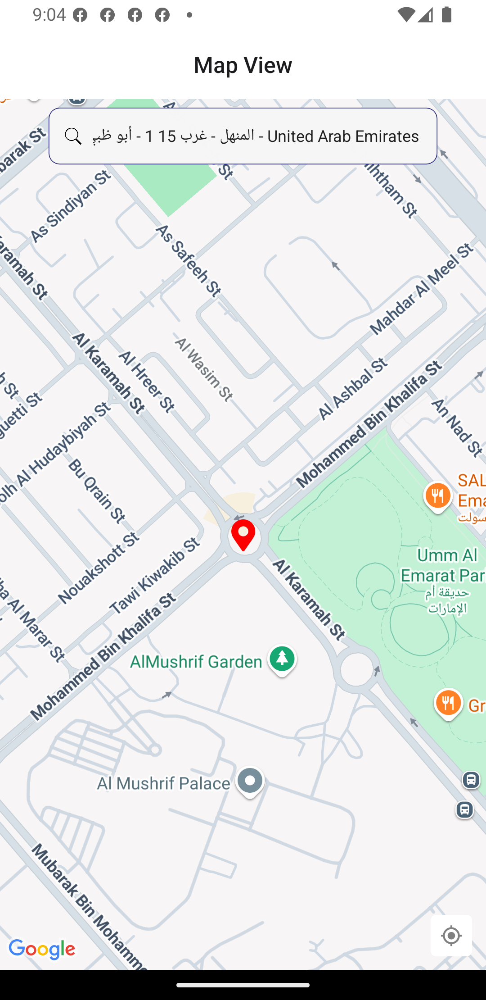
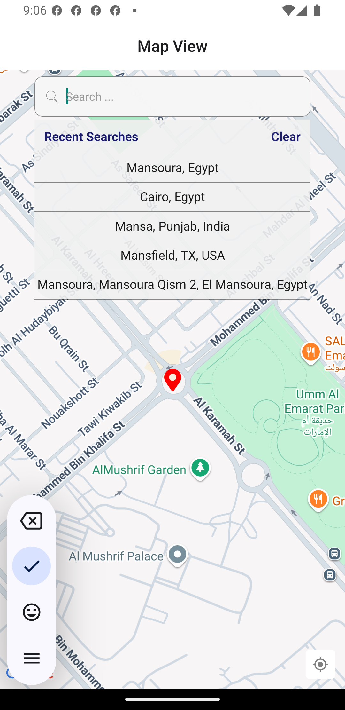
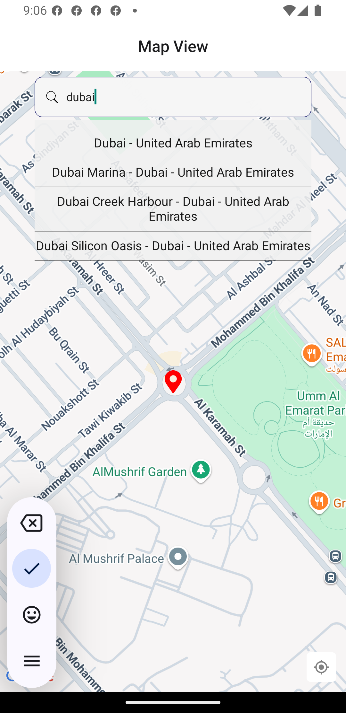

# MapTest React Native Application

## Installation

1. Install dependencies using yarn or npm:

   ```bash
   yarn install
   # or
   npm install
   ```

2. For Google API usage, place your private key in the `.env` file located in the root of the project.  
   You can update or change this key as needed.

3. If testing on iOS, update the Google API key in `ios/maptest/AppDelegate.mm`.

4. Run the app on your desired platform:
   - iOS:
     ```bash
     npx react-native run-ios
     or open with Xcode ..
     ```
   - Android:
     ```bash
     npx react-native run-android
     ```

## Features

### Custom Map Component

- Automatically detects the current user location.
- Search for new places with autocomplete suggestions.
- Map view fits to the selected location.
- When clearing the search input, the search history appears.
- Ability to delete old search history entries.
- Drag the map screen to move the pin; the app detects the dragged position and fetches related data.

### Theme Module

- Provides main colors used throughout the app.
- Includes modules for responsive dimensions such as scale, width, and height to ensure responsiveness.

### Custom UI Components

- Custom-built `AppTextInput` component.
- Global memoized `AppText` component for optimized text rendering.
- Global stylesheet for consistent app styling.

### State Management and Storage

- Uses [MMKV](https://github.com/mrousavy/react-native-mmkv) for storage instead of AsyncStorage for better performance.
- Uses [Zustand](https://github.com/pmndrs/zustand) as the global state manager.
- Both MMKV and Zustand are used to persist search history and other state data.

### Navigation

- Implements the latest React Navigation format for smooth and modern navigation experience.

## Screenshots

### User Location Detected :



### Search History



### Auto Complete



## Project Structure Overview

- `src/components/common/`  
  Contains reusable UI components such as `AppTextInput`, `AppText`, `CustomMapView`, and `MapList`.

- `src/config/theme/`  
  Contains theme-related files including colors, images, and responsive metrics.

- `src/navigation/`  
  Contains navigation setup including `MainNavigator.tsx`.

- `src/screens/`  
  Contains screen components like `HomeScreen.tsx`.

- `src/store/`  
  Contains state management logic using Zustand and MMKV storage.

- `src/utils/`  
  Contains utility functions related to location and other helpers.

- `android/` and `ios/`  
  Native platform-specific code and configuration.

## License

Mohamed Khedewy
Senior React Native Developer
